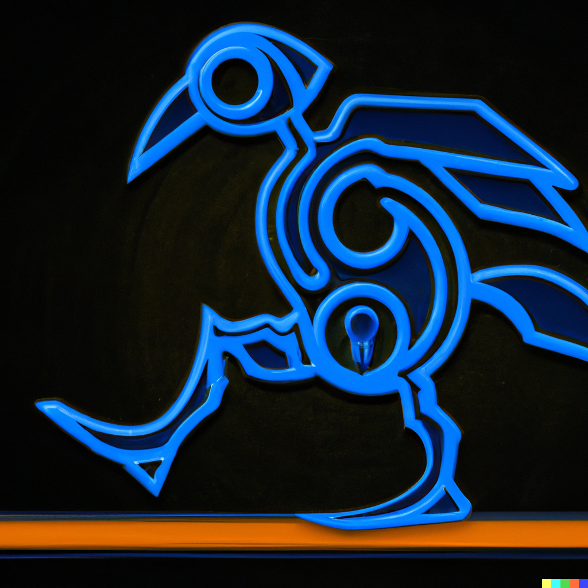

<p align="center">
  
  <h1 style="position: absolute; top: 150px; left: 50%; transform: translateX(-50%); color: white; text-shadow: 2px 2px 2px black;">Repo for UTSA RAS Chapter ROS Bootcamp</h1>
</p>


## Overview
ROS Bootcamp material for UTSA RAS' Summer of Bots. Material derived from https://rsl.ethz.ch/education-students/lectures/ros.html
Repo includes course material and a solutions branch for those that cannot attend the event in person.

## Prerequisites
Requires the following software to be installed on your system:
- ROS Noetic (for Ubuntu 20.04) or ROS Melodic (for Ubuntu 18.04)
- Gazebo (included with ROS installation)

Please ensure that you have the correct version of ROS installed for your operating system before proceeding with the installation. If you need to install ROS, you can follow the instructions on the official ROS website (http://wiki.ros.org/ROS/Installation).

        
## Installation
It is recommended to create a new ROS workspace and copy this repo into it. Instructions for this method below:
1. Create a new workspace and cd into your new src directory
    ```
    mkdir -p ros_bootcamp_ws/src && cd ros_bootcamp_ws
    ```
2. Clone the contents of this repo into your src directory
    ```
    git clone https://github.com/jc-cr/ros_bootcamp .
    ```
    
    To clone a specific branch (*solutions in this case*):
    ```
    git clone https://github.com/jc-cr/ros_bootcamp -b solutions .
    ```

3. Now go up your new workspace and compile the packages:
    ```
    cd .. && catkin_make
    ```
    You should have no errors after running catkin_make.

