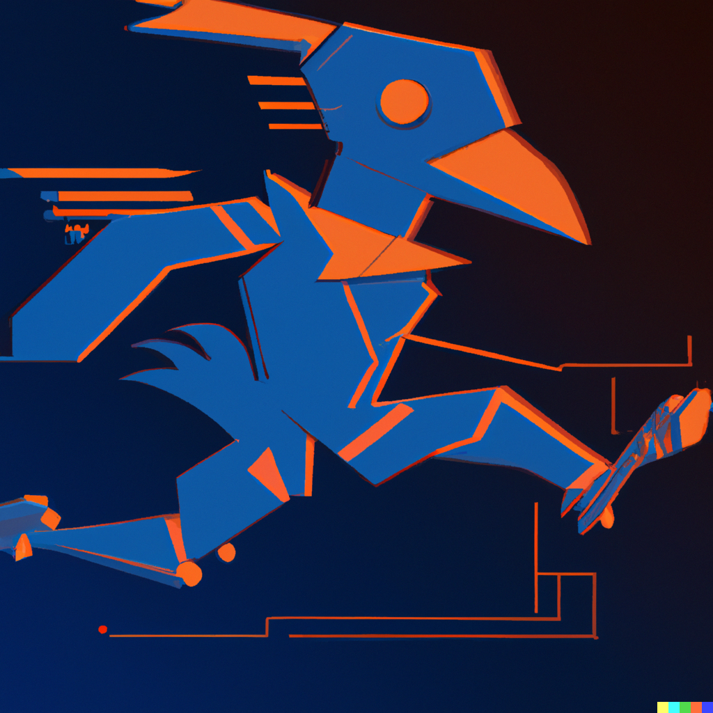

<p align="center">
  
  <h1 style="position: absolute; top: 150px; left: 50%; transform: translateX(-50%); color: white; text-shadow: 2px 2px 2px black;">Repo for UTSA RAS Chapter's ROS Bootcamp</h1>
</p>

## Bootcamp Overview
This bootcamp will give an introduction to the Robot Operating System (ROS) including many of the available tools that are commonly used in robotics. With the help of different examples, the bootcamp should provide a good starting point for students/researchers to work with robots. You'll learn how to create software including simulation, to interface sensors and actuators, and to integrate control algorithms.

Material derived from [ETH Zurich - ROS Course](https://rsl.ethz.ch/education-students/lectures/ros.html)

**Note:** Examples and slides are undergoing changes as of May 2. Check back the day before the first scheduled lecture for the latest material.

All material will be available on our GitHub repository: [https://github.com/UTSARobotics/ros1_bootcamp](https://github.com/UTSARobotics/ros1_bootcamp)


### Scheduling
- 4 lectures over 4 days
    - Dates: May 15 - May 18
    - Time: 6PM - 7:30PM
    - Location: TBD
    - Modality: In-person (Possible live streaming)
- ~30 min lecture with slides
- ~45 min guided activity

### Prerequisites for Bootcamp

Must have **full ROS installation** to participate in this bootcamp. To do so, follow this link: [ROS Install](http://wiki.ros.org/noetic/Installation/Ubuntu)

No prior programming knowledge is required. Examples will be programmed in C++ and explained at a high-level.

For this bootcamp, we will also have about 4 preconfigured computers available in the presentation lab; these may be shared depending on attendance.

We highly recommend bringing your own computer running Ubuntu 20.04 OS to get the most out of this course. However, other options for participating include:
- On Windows 11: [WSL2](https://github.com/ishkapoor2000/Install_ROS_Noetic_On_WSL)
- [Docker container with ROS and Gazebo pre-installed](http://wiki.ros.org/docker/Tutorials/Docker)
- [Virtual machine (e.g., VirtualBox, VMware) with Ubuntu and ROS installed](https://subscription.packtpub.com/book/iot-&-hardware/9781783554713/1/ch01lvl1sec13/setting-ros-on-virtualbox)

> #### Disclaimer
> Please note that the instructor has not personally tested these alternative methods and cannot confirm their compatibility or performance for this course. You may use these alternatives at your own risk, and support may be limited.


### Day-by-Day Breakdown
**Day 1:**
- ROS architecture & philosophy
- ROS master, nodes, and topics
- Console commands
- Catkin workspace and build system
- Launch-files
- Gazebo simulator
- **Activity:** ROS Basics, Build a package, launch files

**Day 2:**
- ROS package structure
- Integration and programming
- ROS C++ client library (roscpp)
- ROS subscribers and publishers
- ROS parameter server
- RViz visualization
- **Activity:** Custom package and node, param server

**Day 3:**
- TF Transformation System
- rqt User Interface
- Robot models (URDF)
- Simulation descriptions (SDF)
- **Activity:** Custom controller, RVIZ

**Day 4:**
- ROS services
- ROS actions (actionlib)
- ROS time
- ROS bags
- Intro to ROS2
- **Activity:** Services, Bag file, RQT Plot

## Repo Installation
It is recommended to create a new ROS workspace and copy this repo into it. Instructions for this method below:
1. Create a new workspace and cd into your new src directory
    ```
    mkdir -p ros_bootcamp_ws/src && cd ros_bootcamp_ws
    ```
2. Clone the contents of this repo into your src directory
    ```
    git clone https://github.com/UTSARobotics/ros1_bootcamp.git .
    ```
    
    To clone a specific branch (*solutions in this case*):
    ```
    git clone https://github.com/UTSARobotics/ros1_bootcamp.git -b solutions .
    ```


## Handling Package Dependencies
Our ROS packages might have specific dependencies on other ROS packages or system libraries. These dependencies are defined in the package.xml file of each package.

To automatically install these dependencies, you can use rosdep. This tool checks the package.xml files in your ROS workspace, identifies the dependencies, and installs them if they are not already installed.

Follow these steps after cloning the repository and before building the workspace:
1. Navigate to the root of your catkin workspace:
    ```
    cd ~/ros_bootcamp_ws

    ```
3. Update rosdep:
    ```
    sudo rosdep init
    rosdep update
    ```
    *May get error after rosdep init. If so just ignore and ro the update command.*
4. Install dependencies:
    ```
    rosdep install --from-paths src --ignore-src -r -y
    ```
5. Build your workspace:
    ```
     catkin_make
    ```
    You should have no errors after running catkin_make.
